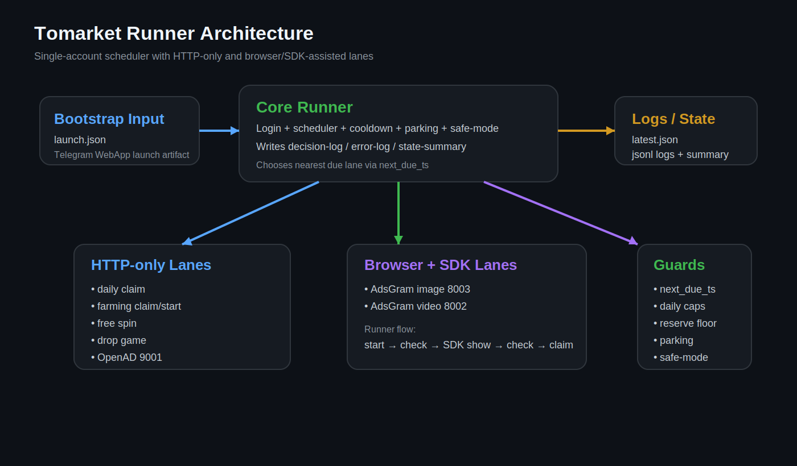
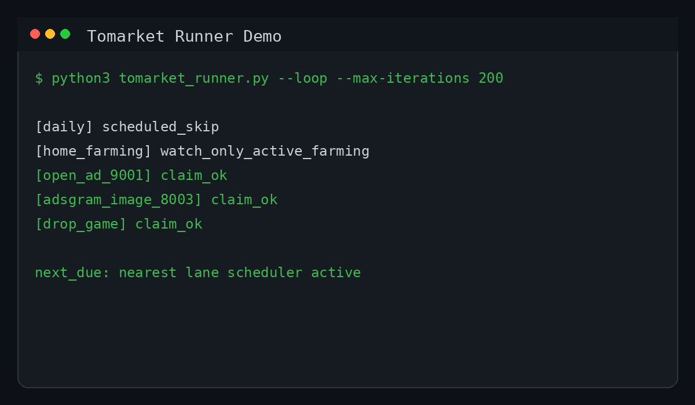
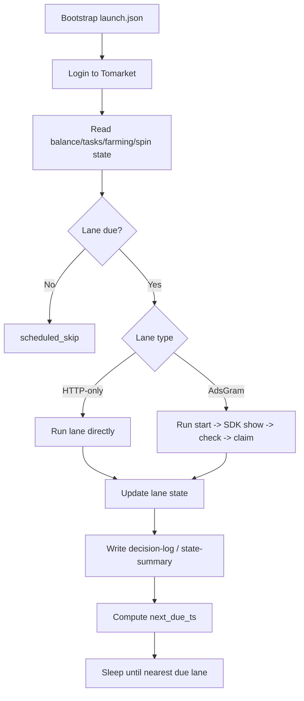
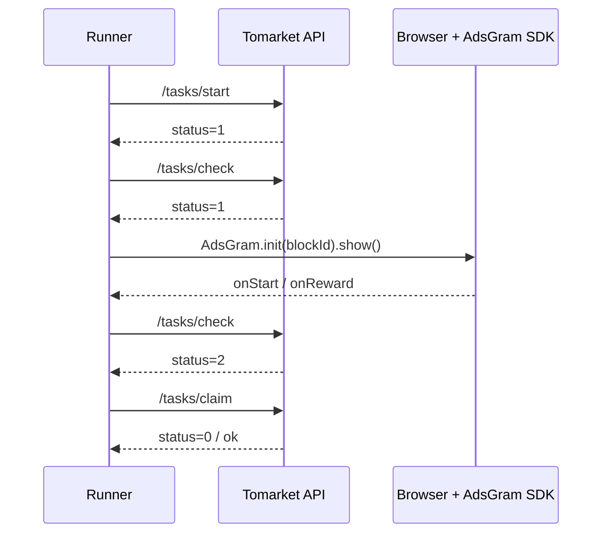
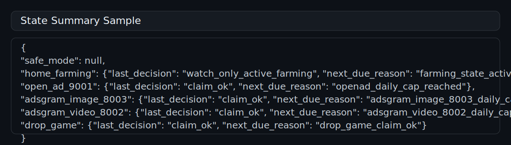
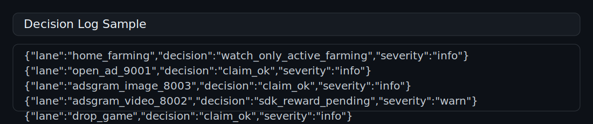

# Tomarket Runner


Single-account Tomarket automation runner with:
- daily claim
- farming claim/start cycle
- free spin
- drop mini-game
- OpenAD task 9001
- AdsGram image/video tasks via real browser SDK execution

## Why this repo exists

This repo is a public-safe extraction of a real Tomarket automation and hardening effort.
It keeps the useful parts of the implementation and architecture, while excluding live launch params, private sessions, and sensitive artifacts.

## Current status

**Current maturity:** production-ready candidate

What that means:
- core earning lanes are implemented
- HTTP-only and browser/SDK-assisted lanes are both covered
- scheduler, backoff, parking, and safe-mode exist
- still needs longer unattended soak validation before claiming final 100% production-ready status

## What it automates

**HTTP-only lanes**
- daily claim
- farming claim/start
- free spin
- drop game
- OpenAD 9001

**Browser/SDK-assisted lanes**
- AdsGram image `8003`
- AdsGram video `8002`

## Use cases

- reverse engineering a Telegram Mini App automation flow
- running a single-account Tomarket claim loop with safety controls
- studying how to combine HTTP-only lanes with browser-assisted SDK lanes
- building a scheduler-driven reward runner with logs, parking, and safe-mode
- using sanitized public code as a reference before adapting it to a private environment

## Architecture overview



Detailed flow diagrams live in [`docs/FLOWS.md`](docs/FLOWS.md).

## Feature matrix

| Area | Lane / Module | Execution model | Current status |
|---|---|---|---|
| Core rewards | Daily claim | HTTP-only | Proven |
| Core rewards | Farming claim/start | HTTP-only | Proven |
| Core rewards | Free spin | HTTP-only | Proven |
| Core rewards | Drop mini-game | HTTP-only | Proven |
| Ad tasks | OpenAD 9001 | HTTP-only | Proven |
| Ad tasks | AdsGram image 8003 | Browser + SDK | Proven |
| Ad tasks | AdsGram video 8002 | Browser + SDK | Proven |
| Safety | Scheduler / next_due_ts | Internal runner logic | Implemented |
| Safety | Lane parking / safe mode | Internal runner logic | Implemented |
| Maturity | Longer unattended soak | Runtime validation | In progress |

## Demo preview



## Flow diagrams

### Runner scheduling overview



### AdsGram hybrid path



## Screenshots / samples

### State summary sample



### Decision log sample



## Repository layout

- `tomarket_runner.py` — main runner
- `tomarket_readonly_probe.py` — safe read-only probe
- `bootstrap.example.json` — example launch artifact shape
- `docs/FLOWS.md` — deeper flow diagrams and state-machine notes
- `docs/DEPLOYMENT.md` — deployment and operational guidance

## Features

- per-lane scheduler with `next_due_ts`
- result-based cooldown and backoff
- farming-first priority
- drop-game reserve floor
- OpenAD daily cap
- AdsGram browser/SDK execution path with Playwright
- decision log, error log, and state summary outputs
- safe-mode and lane parking

## Setup

```bash
python3 -m venv .venv
source .venv/bin/activate
pip install -r requirements.txt
playwright install chromium
```

If you want to use a system Chrome instead of bundled Playwright Chromium:

```bash
export TOMARKET_CHROME=/usr/bin/google-chrome-stable
```

## Bootstrap input

Create a launch artifact at `state/bootstrap/launch.json` using the same shape as `bootstrap.example.json`.
You must provide your own Telegram WebApp launch URL / init data.

## Read-only probe

```bash
python3 tomarket_readonly_probe.py --bootstrap-path state/bootstrap/launch.json
```

## Runner example

```bash
python3 tomarket_runner.py   --bootstrap-path state/bootstrap/launch.json   --loop   --max-iterations 200   --openad-daily-success-cap 2   --adsgram-daily-success-cap 1   --dropgame-play-pass-reserve 4
```

## Deployment guide

See [`docs/DEPLOYMENT.md`](docs/DEPLOYMENT.md) for:
- local test setup
- longer unattended execution considerations
- browser requirements for AdsGram lanes
- safety notes before moving from candidate to true production-ready use

## Output

Runner state is written under `state/runner/`:
- `latest.json`
- `runner-state.json`
- `decision-log.jsonl`
- `error-log.jsonl`
- `state-summary.json`

## FAQ / caveats

**Is this fully production-ready right now?**
Not yet. It is best described as a strong production-ready candidate pending longer unattended soak validation.

**Why are AdsGram lanes different from OpenAD?**
OpenAD can be completed through HTTP-only task flow. AdsGram requires the real browser/SDK execution path, not just REST polling.

**Does this repo include live launch params or sessions?**
No. You must bring your own bootstrap artifact and runtime environment.

**Can I use this as-is on any account?**
No guarantee. Treat it as a strong reference implementation and adapt carefully to your own environment and risk tolerance.

## Public roadmap

- [ ] finish longer unattended soak validation
- [ ] tighten reward-sink visibility for `9001 open_ad`
- [ ] close star settlement/readback mapping
- [ ] document safer deployment patterns for long-lived runner execution
- [ ] prepare a cleaner multi-account design only after single-account stability is fully proven

## Notes

- AdsGram lanes depend on real browser/SDK execution. Plain REST polling is not enough.
- This repo is a **production-ready candidate**, not a promise that every account or environment will behave identically.
- Bring your own launch bootstrap and use at your own risk.
