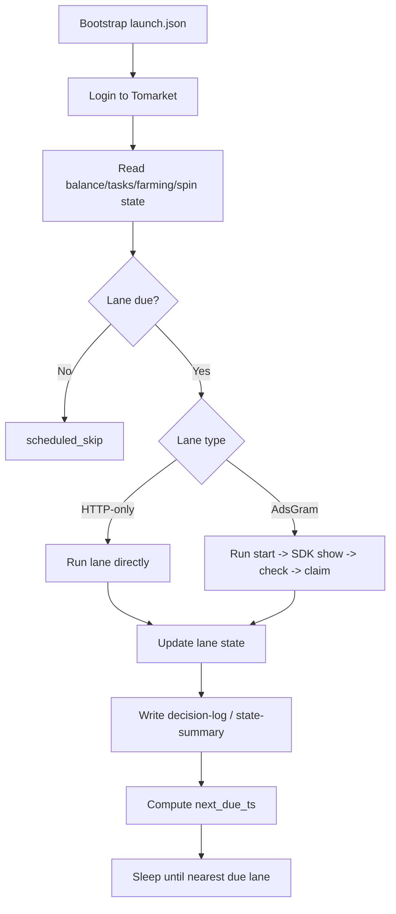
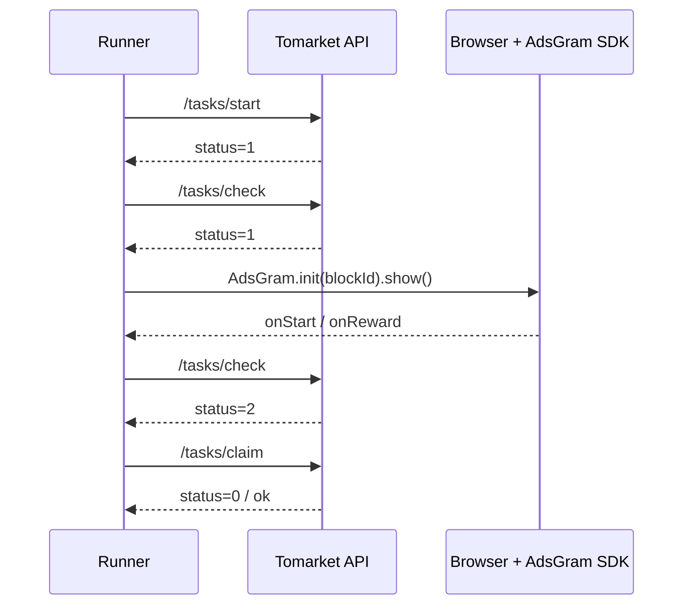

# Tomarket Runner


Single-account Tomarket automation runner with:
- daily claim
- farming claim/start cycle
- free spin
- drop mini-game
- OpenAD task 9001
- AdsGram image/video tasks via real browser SDK execution

## Why this repo exists

This repo is a public-safe extraction of the Tomarket runner work.
It preserves the architecture, scheduling, lane logic, and browser-assisted AdsGram path, while excluding live launch params, private sessions, and sensitive artifacts.

## What it automates

**HTTP-only lanes**
- daily claim
- farming claim/start
- free spin
- drop game
- OpenAD 9001

**Browser/SDK-assisted lanes**
- AdsGram image `8003`
- AdsGram video `8002`

## Flow diagrams

Detailed diagrams live in [`docs/FLOWS.md`](docs/FLOWS.md).

### Runner scheduling overview



### AdsGram hybrid path



## Sanitized screenshots

### State summary sample


### Decision log sample


## Repository layout

- `tomarket_runner.py` — main runner
- `tomarket_readonly_probe.py` — safe read-only probe
- `bootstrap.example.json` — example launch artifact shape
- `docs/FLOWS.md` — deeper flow diagrams and state-machine notes

## Features

- per-lane scheduler with `next_due_ts`
- result-based cooldown and backoff
- farming-first priority
- drop-game reserve floor
- OpenAD daily cap
- AdsGram browser/SDK execution path with Playwright
- decision log, error log, and state summary outputs
- safe-mode and lane parking

## Setup

```bash
python3 -m venv .venv
source .venv/bin/activate
pip install -r requirements.txt
playwright install chromium
```

If you want to use a system Chrome instead of bundled Playwright Chromium:

```bash
export TOMARKET_CHROME=/usr/bin/google-chrome-stable
```

## Bootstrap input

Create a launch artifact at `state/bootstrap/launch.json` using the same shape as `bootstrap.example.json`.
You must provide your own Telegram WebApp launch URL / init data.

## Read-only probe

```bash
python3 tomarket_readonly_probe.py --bootstrap-path state/bootstrap/launch.json
```

## Runner example

```bash
python3 tomarket_runner.py   --bootstrap-path state/bootstrap/launch.json   --loop   --max-iterations 200   --openad-daily-success-cap 2   --adsgram-daily-success-cap 1   --dropgame-play-pass-reserve 4
```

## Output

Runner state is written under `state/runner/`:
- `latest.json`
- `runner-state.json`
- `decision-log.jsonl`
- `error-log.jsonl`
- `state-summary.json`

## Notes

- AdsGram lanes depend on real browser/SDK execution. Plain REST polling is not enough.
- This repo is a **production-ready candidate**, not a promise that every account or environment will behave identically.
- Bring your own launch bootstrap and use at your own risk.
