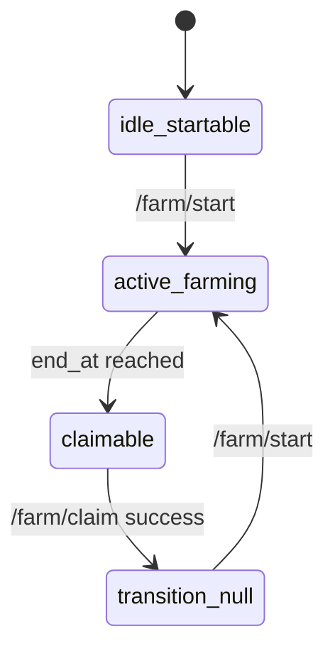
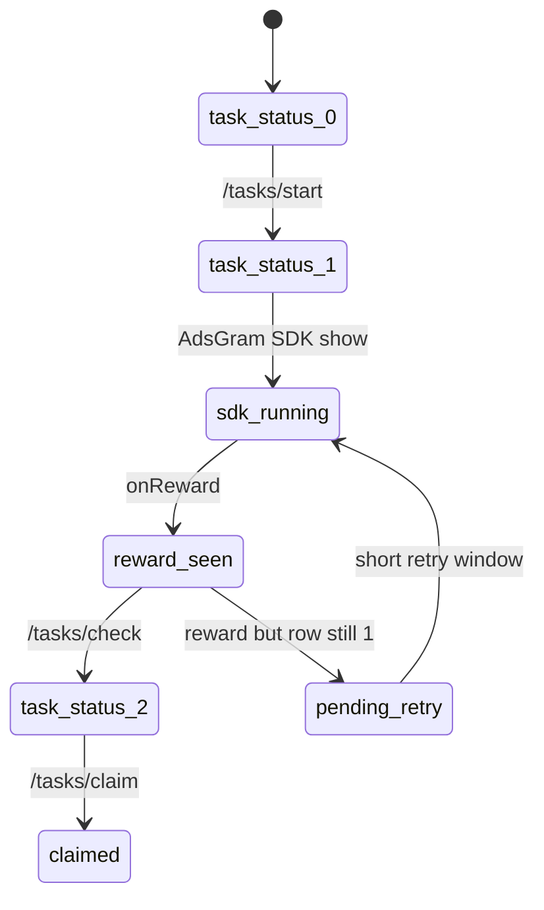

# Tomarket Flows

## 1. Lane priority

```mermaid
flowchart TD
    A[Read latest state] --> B{Farming claimable?}
    B -->|Yes| C[Claim farming]
    C --> D[Short settle window]
    D --> E[Start new farming round]
    B -->|No| F{Daily due?}
    F -->|Yes| G[Claim daily]
    F -->|No| H{AdsGram/OpenAD due?}
    H -->|Yes| I[Run ad lane with caps and parking]
    H -->|No| J{Drop due and passes above reserve?}
    J -->|Yes| K[Play + claim drop]
    J -->|No| L[Sleep until nearest due lane]
```

## 2. Farming state machine

## 3. AdsGram hybrid state machine

## 4. Safety controls

- per-lane `next_due_ts`
- daily success caps for ad lanes
- parked risky lanes after repeated failures
- global safe-mode to suppress risky lanes temporarily
- compact decision and error logs for unattended review
